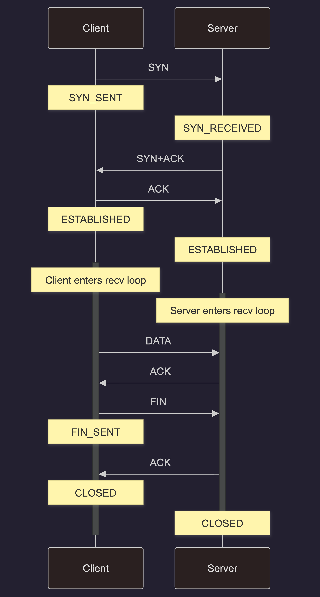

# Reliable UDP

A simple implementation of a reliable communication protocol built on top of UDP, inspired by TCP principles. This project demonstrates core networking concepts including packet serialization, connection state machines, and acknowledgment-based reliability.

## Overview

This implementation provides a client-server model where:
- **Client** initiates a connection, sends data in chunks, and gracefully closes the connection
- **Server** listens for incoming connections, receives data, and acknowledges receipt
- **Protocol** uses sequence numbers, acknowledgments, and handshakes to ensure reliable delivery over unreliable UDP

## Architecture

The codebase is organized into modular layers:

```
src/                    # Implementation files
├── server.c           # Server entry point (socket setup, I/O loop)
├── client.c           # Client entry point (socket setup, timeout handling)
├── packet.c           # Wire protocol (serialization/deserialization)
├── transport.c        # UDP transport layer (sendto)
└── connection.c       # Connection state machine (client & server handlers)

include/               # Header files
├── common.h          # Shared configuration (port, timeouts)
├── packet.h          # Packet struct & flags
├── transport.h       # send_packet API
└── connection.h      # connection_t struct & state handlers
```

## Protocol Overview

### States



### Packet Format

```c
struct tcp_packet_t {
    uint32_t flags;           // FLAG_SYN, FLAG_ACK, FLAG_DAT, FLAG_FIN
    uint32_t seq_num;         // Sequence number
    uint32_t ack;             // Acknowledgment number
    uint16_t payload_len;     // Data length
    char payload[1024];       // Payload data
}
```

All multi-byte fields are sent in network byte order (big-endian).

## Building & Running

### Build

```bash
make
```

Compiles `server` and `client` binaries. The Makefile:
- Includes `include/` directory for headers
- Links all required source files
- Applies compiler flags: `-Wall -Wextra -std=c11`

### Run

**Terminal 1: Start the server**
```bash
./server
```

**Terminal 2: Run the client**
```bash
./client
```

Expected output:
- Server receives "HELLO WORLD!" in chunks and prints each
- Client sends data, receives ACKs, and closes cleanly

### Clean

```bash
make clean
```

Removes compiled binaries.